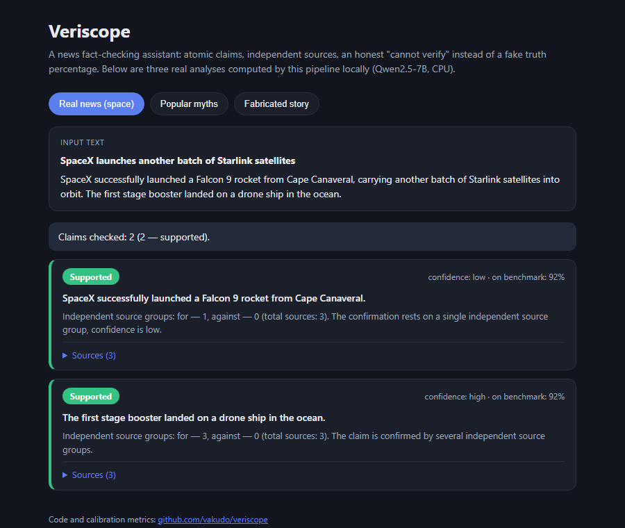

# Veriscope

[](https://github.com/vakudo/veriscope/actions/workflows/ci.yml)
[](LICENSE)

A news fact-checking **assistant** — not a "truth detector". It decomposes a news
article into atomic checkable claims, retrieves evidence for each claim from the
web, checks how independent the sources really are, and reports per-claim
verdicts with citations. When there is not enough evidence, it honestly says
"cannot verify" instead of inventing a fake confidence percentage.

[](https://vakudo.github.io/veriscope/)

## Why not a truth score

An LLM cannot reliably measure "how true" a news story is, and a made-up
percentage is worse than no score at all — it creates an illusion of precision.
Veriscope instead makes the verification process transparent:

- splits the story into atomic, independently checkable claims;
- scans long articles in overlapping chunks sampled across the full document,
  then deduplicates and selects claims round-robin so the ending is not ignored;
- searches evidence per claim and shows sources with dates and types
  (possible primary source / reprint / opinion);
- reports a transparent domain-based source category (official, academic,
  fact-check, social or other) without turning it into a hidden trust score;
- classifies the stance of every (claim, source) pair:
  `supports` / `refutes` / `not_enough_info`;
- checks **source independence**: 20 reprints of one press release count as one
  piece of evidence, not twenty (near-duplicate clustering over embeddings +
  earliest-publication heuristic for the likely primary source);
- searches for counter-evidence explicitly (a second refutation-oriented query
  per claim) and cross-lingually (Russian claims are also checked against
  English sources);
- can experimentally plan concrete verification questions and focused searches
  from date, speaker, location and article-title context (`QUERY_PLANNING=true`),
  while the measured default remains the simpler neutral/counter-evidence search;
- reads the full article of each cluster representative and judges stance on
  the most relevant paragraphs, not on a search snippet;
- re-verifies contested stance judgements: when sources disagree, the minority
  opinion is asked again and dropped if unstable;
- flags manipulation signals: clickbait headline, anonymous sources, emotional
  wording, missing dates/names;
- reports honest verdicts per claim: `supported` / `refuted` / `conflicting` /
  `unverifiable`, with a coarse `high`/`low` confidence based on the number of
  **independent** source groups — never a percentage.

## Architecture

```
Entry point (browser extension)
        ↓
Text extraction (trafilatura)
        ↓
Claim decomposition (LLM → atomic claims)
        ↓
Evidence retrieval (web search + embedding rerank, per claim)
        ↓
Independence check (near-duplicate clustering, primary-source heuristic)
        ↓
Stance detection (per claim × source pair)
        ↓
Verdict + explanation (per claim, with manipulation flags and citations)
```

Essentially RAG turned inside out: not "find the answer", but "find evidence
for and against a statement".

## Stack

- **FastAPI** backend (`app/`)
- **Manifest V3** browser extension (`extension/`)
- **trafilatura** for article text extraction
- **Qwen2.5** (or any OpenAI-compatible endpoint: Ollama, vLLM, OpenRouter) for
  claim extraction, stance detection and embeddings
- **DuckDuckGo** web search for evidence retrieval
- **pgvector** evidence cache (optional; falls back to in-memory)
- PostgreSQL-backed result cache with TTL when `DATABASE_URL` is configured
- Docker Compose + GitHub Actions CI

## Quickstart

### Local

```bash
python -m venv .venv
.venv/Scripts/activate        # Windows; on Linux/macOS: source .venv/bin/activate
pip install -r requirements-dev.txt
copy .env.example .env        # fill in the LLM endpoint
uvicorn app.main:app --reload
```

An OpenAI-compatible LLM endpoint must be reachable (default:
Ollama at `http://localhost:11434/v1` with `qwen2.5:7b-instruct` for chat and
`bge-m3` for embeddings).

The model is a config value, not a dependency: point `LLM_MODEL` /
`LLM_BASE_URL` in `.env` at any OpenAI-compatible endpoint (Ollama, vLLM,
OpenRouter). A smaller model such as `qwen2.5:3b-instruct` makes analysis
several times faster on CPU at some quality cost — the published calibration
numbers were measured with the 7B default, so re-run
`python -m scripts.calibrate` if you switch.

Load the extension: `chrome://extensions` → Developer mode → Load unpacked →
select the `extension/` folder. The backend URL is configurable in the popup.

### Docker

```bash
docker compose up --build
```

Starts Postgres with pgvector (evidence cache) and the API on port 8000.
The LLM endpoint is configured via `.env`. Completed analyses are kept in
PostgreSQL until `RESULT_CACHE_TTL_SECONDS` expires, so repeated requests remain
fast after an API restart; local mode uses the same policy in memory. Cached
rows contain the structured verdict, extracted claims and evidence citations,
but not the original full article text.

The runtime image runs as the unprivileged `veriscope` user and exposes a
readiness-based Docker health check. Compose drops Linux capabilities from the
API container.

### API

```bash
curl -X POST http://localhost:8000/api/analyze \
  -H "Content-Type: application/json" \
  -H "X-API-Key: $API_ACCESS_KEY" \
  -d '{"url": "https://example.com/news/article"}'
```

Request: `{"text": "..."}` or `{"url": "..."}` (optional `"title"`).
Response: per-claim verdicts with evidence, stances, source types, independence
clusters, manipulation flags and a summary.

`GET /api/health` is a process liveness check. `GET /api/ready` additionally
checks that the configured OpenAI-compatible LLM endpoint responds.

Every response includes an `X-Request-ID`. `GET /api/metrics` exposes
Prometheus-compatible request counters, durations and the in-flight gauge.
Access logs are structured JSON containing request metadata only; article text,
claims, search queries and evidence are never written to those logs.

### Production safety

URL analysis accepts only public HTTP(S) destinations. Veriscope validates DNS
answers and every redirect target, rejects private, loopback, link-local and
reserved addresses, and stops downloads above `MAX_ARTICLE_BYTES` (5 MB by
default). API text, URL and title fields have explicit size limits.

Analysis endpoints use a per-process, per-client rate limit controlled by
`RATE_LIMIT_REQUESTS` and `RATE_LIMIT_WINDOW_SECONDS`. For a multi-instance
deployment, put a shared rate limiter at the gateway as well. `CORS_ORIGINS` is
a comma-separated allowlist; its local-development default is `*`, so hosted
deployments should set explicit frontend and extension origins.

Set `API_ACCESS_KEY` on a hosted beta to require the `X-API-Key` header on both
analysis endpoints. An empty value keeps local development unauthenticated.
Health, readiness and metrics stay available to infrastructure probes. The
browser extension stores its optional key in local extension storage (not
synced between browsers).

### Tests

```bash
pytest
ruff check .
```

The test suite runs fully offline: LLM, search and embeddings are replaced with
deterministic fakes via dependency injection.

### Beta release

Every CI run builds the production container and a deterministic browser
extension archive. Download `veriscope-extension` from the workflow artifacts
to test the exact package produced from a commit.

To build the same archive locally:

```bash
python -m scripts.package_extension
```

Pushing a tag that exactly matches the shared application and extension version
(for example `v0.4.0`) runs the full test suite and creates a GitHub release with
the ZIP attached. A mismatched tag fails before publishing.

## Calibration: honest confidence instead of a fake score

The system never outputs "this news is 87% true". Instead, confidence is
*measured*: a labeled set of claims is run through the full pipeline, and the
per-verdict accuracy becomes the number shown in the UI ("verdicts of this
type were correct in N% of benchmark cases").

```bash
python -m scripts.calibrate data/calibration_full.jsonl
```

The script runs every claim through the real pipeline (web search, independence
clustering, stance detection), compares the produced verdict against the gold
label and writes per-label statistics to `calibration.json` (gitignored — it is
a local measurement artifact, not source code). The backend picks the file up
on startup and attaches `historical_accuracy` to every verdict.

Honesty guards built in:

- a percentage is only shown for verdict types with at least 20 benchmark
  samples (`CALIBRATION_MIN_SAMPLES`); small buckets are silently dropped —
  4/4 correct is luck, not a statistic;
- verdict types with no data show nothing rather than a made-up number;
- `data/calibration_full.jsonl` (75 claims) mixes well-documented facts,
  popular misconceptions and deliberately fabricated local "news" that no
  search can confirm — the latter measure how honestly the system says
  "cannot verify".

Measured on this set (qwen2.5:7b-instruct + nomic-embed-text, CPU, July 2026),
overall accuracy 83% (62/75):

| Produced verdict | Samples | Accuracy |
|---|---|---|
| supported | 29 | 93% |
| refuted | 21 | 81% |
| unverifiable | 25 | 72% |
| conflicting | 0 | — |

Notable results:

- **no fabricated story was ever confirmed** — 18 of the 20 got "cannot
  verify" and 2 got "refuted"; saying "false" instead of "cannot verify" is
  imprecise but directionally safe, and confirming a non-existent event (the
  failure mode that matters most) never happened;
- **"conflicting" no longer occurs on this set — by design.** In earlier runs
  every single-group conflict verdict was wrong (8/8): one noisy stance
  judgement flipped an otherwise clear claim. A conflict now requires at
  least two independent refuting groups, and a lone dissenting group is
  treated as noise;
- the remaining weak spot is the `unverifiable` bucket (72%): real claims
  whose evidence retrieval came up empty — an argument for better retrieval
  and for fine-tuning the stance component (see evaluation plan).

## Demo

**Live: [vakudo.github.io/veriscope](https://vakudo.github.io/veriscope/)**

`docs/index.html` is a static demo with three pre-computed analyses (a real
news story, a myth compilation, a fabricated local story) produced by this
pipeline locally. Regenerate with a running backend:

```bash
python -m scripts.build_demo
```

The page is deployed to GitHub Pages automatically by the `pages` workflow on
every change to `docs/`.

## Evaluation plan

- **AVeriTeC** — primary benchmark: real-world claims with web evidence and
  justifications; mirrors this pipeline end to end.
- **FEVER / FEVEROUS** — evaluating the stance component
  (supports / refutes / NEI).
- Russian sets (Fakespeak-RUS, Kuzmin et al. 2020, the Kazakh-Russian
  7-category corpus) — **qualitative cross-lingual evaluation only**, not
  training data: they are small and their labels carry the bias of specific
  fact-checking agencies.

The full plan towards v1.0 lives in [ROADMAP.md](ROADMAP.md).

### Reproducible AVeriTeC evaluation

Veriscope includes a benchmark harness that runs normalized AVeriTeC claims
through the real retrieval and verdict pipeline. It writes predictions compatible
with the official evaluator plus a standalone report with accuracy, macro-F1,
per-label precision/recall/F1, abstention metrics and a confusion matrix.

Download AVeriTeC separately and keep its dataset outside this repository. The
official data is licensed CC BY-NC 4.0 and is intentionally not redistributed here.

```bash
git clone --depth 1 https://github.com/MichSchli/AVeriTeC.git ../AVeriTeC
python -m scripts.evaluate_averitec ../AVeriTeC/data/dev.json --limit 20
```

For a deterministic balanced baseline across all four labels, use:

```bash
python -m scripts.evaluate_averitec ../AVeriTeC/data/dev.json \
  --sample-per-label 5 --seed 42 --output-dir artifacts/averitec-baseline-20
```

Measured runs, newest first:

- [`docs/evaluation/averitec-stratified-100.md`](docs/evaluation/averitec-stratified-100.md) —
  100 claims (25 per label): accuracy 37%, macro-F1 31%, abstention 42%.
  Refutations now trade recall for precision (a wrong claim more often gets
  "cannot verify" than a confident wrong verdict), and AVeriTeC's combined
  conflicting/cherrypicking class is a documented blind spot.
- [`docs/evaluation/averitec-baseline-20.md`](docs/evaluation/averitec-baseline-20.md) —
  the first exploratory 20-claim baseline and its failure-mode analysis.

Add `--strict-dates` to reject evidence whose publication date cannot be
established. Without it, undated evidence remains eligible for better recall. Both
modes report publication-date coverage in `metrics.json`.

The LLM query planner is experimental and disabled by default because its first
frozen comparison increased retrieval recall but reduced verdict quality. Reproduce
that experiment with `--query-planner`; see
[`docs/evaluation/averitec-query-planner-20.md`](docs/evaluation/averitec-query-planner-20.md).

Results and a selection manifest containing the dataset SHA-256 and original row
indices are checkpointed under `artifacts/averitec/`. Continue
an interrupted matching run with `--resume`. Omit `--limit` for the complete dev
split. The harness excludes the target fact-check publisher domain from retrieval
to reduce answer leakage and disables cross-claim caching so results do not depend
on evaluation order. Sources with a known publication date after the AVeriTeC claim
date are excluded both after search and after full-page extraction. Sources with no
recoverable date remain eligible and must be reported as a limitation of benchmark
runs.

## A note on bias

Fact-checking labels — especially for Russian-language news — are politically
loaded and inherit the perspective of whoever produced them. This project does
not claim to escape that: it deliberately reports *evidence and its
independence structure* instead of a single truth score, keeps "cannot verify"
as a first-class answer, and treats Russian-language evaluation as a
cross-lingual transfer study rather than ground truth.

## Project structure

```
app/
  main.py            FastAPI app factory
  config.py          settings (env-driven)
  schemas.py         API and pipeline models
  llm.py             OpenAI-compatible chat + embeddings client
  api/routes.py      analysis, health, readiness and metrics endpoints
  cache/store.py     evidence cache (pgvector or in-memory)
  pipeline/
    extract.py       article text extraction
    claims.py        claim decomposition
    search.py        web search + embedding rerank
    independence.py  near-duplicate clustering, source typing
    stance.py        per (claim, source) stance detection
    manipulation.py  clickbait / anonymity / emotion / attribution heuristics
    verdict.py       verdict aggregation over independent clusters
    runner.py        pipeline orchestration
extension/           Manifest V3 browser extension
tests/               offline unit + API tests with fakes
```
